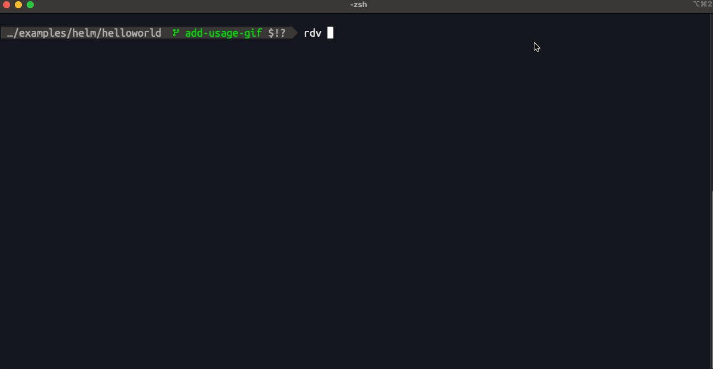

# rdv (render-diff-validate)
`rdv` provides a fast and local preview of your rendered Kubernetes manifest changes.

It renders your local Helm chart or Kustomize overlay, validates rendered manifests via kubeconform and then compares the resulting manifests against the version in a target git ref (like 'main' or 'develop').

It prints a colored diff of the final rendered YAML.



## Requirements
* `make`
* `git`
* Go `1.24` or newer

## Installation

You can install `rdv` directly using `go install`:

```sh
go install github.com/dlactin/rdv@latest
```

# Flags
| Flag | Shorthand | Description | Default |
| :--- | :--- | :--- | :--- |
| `--debug` | `—` | Enable verbose logging for debugging | `false` |
| `--help` | `h` | help for rdv | `false` |
| `--output` | `o` | Write the local and target rendered manifests to a specific file path | `—` |
| `--path` | `p` | Relative path to the chart or kustomization directory | `.` |
| `--plain` | `—` | Output in plain style without any highlighting | `false` |
| `--ref` | `r` | Target Git ref to compare against. Will try to find its remote-tracking branch (e.g., origin/main) | `main` |
| `--semantic` | `s` | Enable semantic diffing of k8s manifests (using dyff) | `false` |
| `--update` | `u` | Update Helm chart dependencies. Required if lockfile does not match dependencies | `false` |
| `--validate` | `v` | Validate rendered manifests with kubeconform | `false` |
| `--values` | `f` | Path to an additional values file (can be specified multiple times) | `[]` |
| `--version` | `—` | version for rdv | `false` |

# Examples
This must be run while your current directory is within your git repository

### Checking a Helm Chart diff against another target ref

```bash
rdv -p ./examples/helm/helloworld -f values-dev.yaml -r development
```

### Checking a Helm Chart diff and validating our rendered manifests

```bash
rdv -p ./examples/helm/helloworld --validate
```

### Checking Kustomize diff against the default (main) branch with semantic diff

```bash
rdv -p ./examples/kustomize/helloworld -s
```

### Checking Kustomize diff against a tag

```bash
rdv -p ./examples/kustomize/helloworld -r tags/v0.5.1
```
	