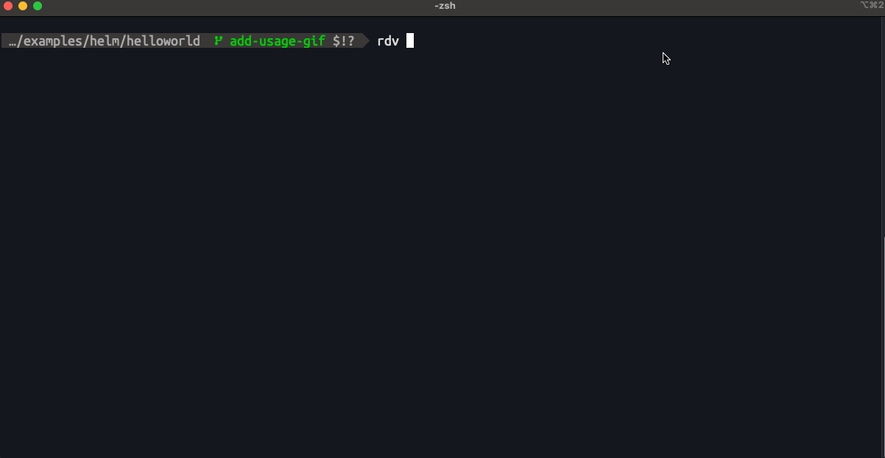

# RDV (render-diff-validate)

`rdv` lets you preview your GitOps changes without committing rendered manifests.

It renders your local Helm chart or Kustomize overlay, optionally validates the output with kubeconform, and compares the results against a target git ref (such as `main` or `develop`).

A coloured diff shows exactly what will change before you push.

## Key Features

- **Preview Changes**: See exactly what manifests will be generated before you commit.
- **Validation**: Ensure your rendered manifests are valid Kubernetes objects.
- **Comparison**: Diff against any git branch, tag, or commit hash.
- **Support**: Works with both Helm and Kustomize.
- **Semantic Diffing**: Optionally use `dyff` for cleaner, semantic-aware diffs of Kubernetes manifests.
